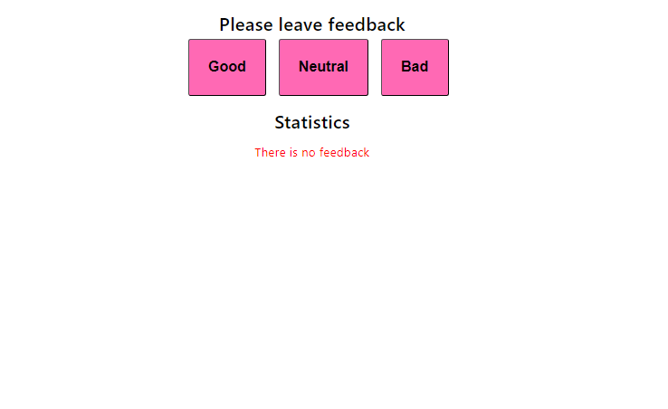
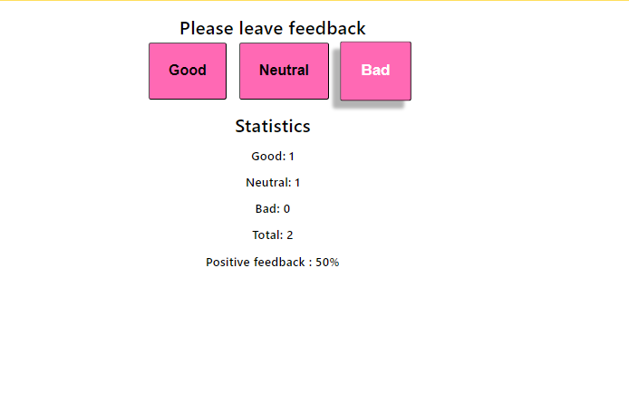

# feedback

Цей проєкт був створений за допомогою Create React App.
[Create React App](https://github.com/facebook/create-react-app). 

## Expresso

Like most companies, Expresso café collects feedback from its customers. The task was to create an application for collecting statistics. There are only three options for feedback: good, neutral, and bad. Later, the display of the total number of collected reviews from all categories and the percentage of positive reviews was added.
. 
.

Styling was done using Styled Components. A message about the absence of statistics has been created.

## Contscts

If you have any questions, suggestions, or need assistance, feel free to contact our support team at Liussi@ukr.net. We're here to help!