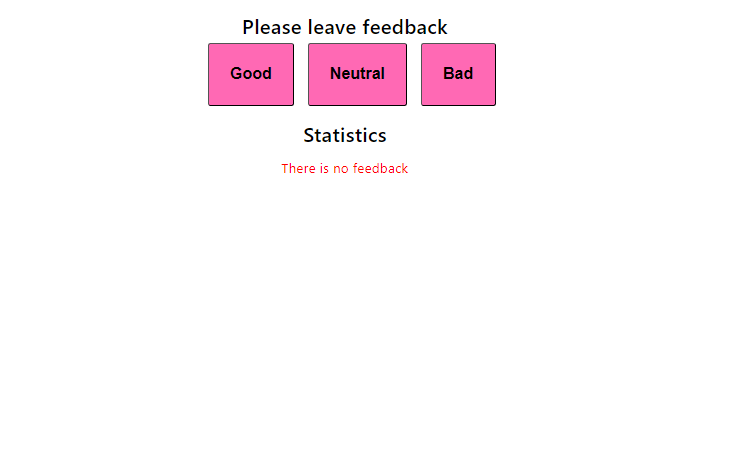

# feedback

Цей проєкт був створений за допомогою Create React App.
[Create React App](https://github.com/facebook/create-react-app). 

## Expresso

Як і більшість компаній, кафе Expresso збирає відгуки від своїх клієнтів. Було завдання - створити додаток для збору статистики. Є лише три варіанти зворотного зв'язку: добре, нейтрально і погано. І пізніше додано відображення загальної кількості зібраних відгуків з усіх категорій та відсоток позитивних відгуків.
. 
.

 Стилізація виконана Styled Components.Створено повідомлення про відсутність статистики.

## Контакти

Якщо у вас є питання, пропозиції або вам потрібна допомога, не соромтеся звертатися до нашої служби підтримки за адресою Liussi@ukr.net